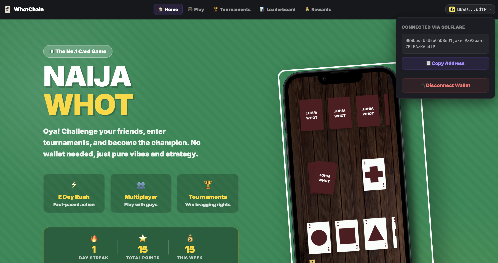

# Dex Naija Whot - Backend Server 🎮

<br />

<br />

This is the backend server for Dex Naija Whot, a multiplayer web-based card game. The server handles real-time multiplayer game sessions using Socket.io.

🚧 **This application is still in its infancy stage and under active development.**

## 🌐 Live Demo
- **Backend API**: https://dex-naija-whot-backend.onrender.com
- **Frontend App**: https://dex-naija-whot.vercel.app
- **Frontend Repository**: https://github.com/vortex-hue/dex-naija-whot.git

## ⚙️ Technologies 

**Backend Stack:**
- Node.js
- Socket.io (Real-time communication)
- Express.js (Web framework)
- CORS (Cross-origin resource sharing)

**Additional Dependencies:**
- @honeycomb-protocol/hive-control (Solana integration)
- @solana/web3.js (Solana blockchain interaction)

## 🚀 Running the Project Locally

### Prerequisites
- Node.js (v18.x or higher)
- npm or yarn package manager

### Installation & Setup

1. **Clone the repository**
   ```bash
   git clone https://github.com/vortex-hue/dex-naija-whot-backend.git
   cd dex-naija-whot-backend
   ```

2. **Install dependencies**
   ```bash
   npm install
   ```

3. **Start the development server**
   ```bash
   npm start
   # or
   node index.js
   ```

4. **Server will start on port 8080**
   ```
   🚀 Socket.io server starting on port 8080...
   ```

### Available Scripts

- `npm start` - Start the production server
- `npm run dev` - Start the development server (same as start)
- `node index.js` - Direct Node.js execution

## 🔧 Configuration

### Environment Variables
The server automatically detects the environment:
- `PORT` - Server port (default: 8080)
- `NODE_ENV` - Environment mode
- `VERCEL` - Vercel deployment detection

### CORS Configuration
The server is configured to accept connections from:
- `https://dex-naija-whot.vercel.app` (Production frontend)
- `http://localhost:3000` (Local development)
- `http://127.0.0.1:3000` (Local development)

## 🐛 Debugging Commands

### Server Health Check
```bash
# Check if server is running
curl https://dex-naija-whot-backend.onrender.com/

# Check API health endpoint
curl https://dex-naija-whot-backend.onrender.com/api/health
```

### Local Testing
```bash
# Test Socket.io connection locally
node -e "
const io = require('socket.io-client');
const socket = io('http://localhost:8080');
socket.on('connect', () => console.log('✅ Connected to server'));
socket.on('disconnect', () => console.log('❌ Disconnected from server'));
"
```

### Debug Logs
```bash
# Run with debug logs
DEBUG=socket.io* node index.js

# Check server logs on Render
# Go to your Render dashboard > dex-naija-whot-backend > Logs
```

### Common Issues & Solutions

1. **Port already in use**
   ```bash
   # Find and kill process using port 8080
   lsof -ti:8080 | xargs kill
   ```

2. **Module not found errors**
   ```bash
   # Clear node modules and reinstall
   rm -rf node_modules package-lock.json
   npm install
   ```

3. **Socket.io connection issues**
   ```bash
   # Check if port is accessible
   telnet localhost 8080
   ```

## 📁 Project Structure

```
whot-server/
├── index.js                 # Main server file
├── package.json             # Dependencies and scripts
├── vercel.json              # Vercel deployment config
├── utils/
│   ├── classes/
│   │   └── Card.js          # Card class definition
│   └── functions/
│       ├── initializeDeck.js    # Game deck initialization
│       ├── randomCard.js        # Random card selection
│       └── reverseState.js      # Game state reversal
├── public/
│   └── MultiplayerMockup.png    # Game mockup image
└── README.md
```

## 🎮 Game Features (Stable Edition)

- **Real-time Multiplayer**: Powered by Socket.io with low-latency event broadcasting.
- **Tournament Engine**: Advanced bracket management for 2, 4, and 8-player tournaments.
- **Authoritative Winner Resolution**: Server-side logic to resolve winner IDs and prevent client-side desyncs.
- **Infinite Market Flow**: Coordinates with the frontend to ensure the market deck never depletes.
- **Stability Safeguards**:
    - **Defensive Timer Loop**: Safeguards against uninitialized room crashes.
    - **Fair Match Start**: Timers (when enabled) start only when both players are connected.
    - **Cleanup Logic**: Automated room disposal (default 1 hour after match completion).
- **Online/Offline Detection**: Real-time monitoring of opponent connection states.
- **Chat System**: Integrated real-time chat with message status tracking.

## 🚀 Deployment

### Render.com (Current)
The server is deployed on Render.com with automatic deployments from the main branch.

**Deployment Settings:**
- Build Command: `npm install`
- Start Command: `npm start`
- Environment: Node.js

### Alternative Deployments
The server can also be deployed to:
- Railway.app
- Heroku
- DigitalOcean App Platform

## 🤝 Contributing

Contributions are welcome! Here's how to contribute:

1. **Fork the repository**
2. **Create a feature branch**
   ```bash
   git checkout -b feature/your-feature-name
   ```
3. **Make your changes**
4. **Test locally**
   ```bash
   npm start
   ```
5. **Commit your changes**
   ```bash
   git commit -m "Add: your feature description"
   ```
6. **Push to your fork**
   ```bash
   git push origin feature/your-feature-name
   ```
7. **Create a Pull Request**

### Development Guidelines
- Follow existing code style
- Test all Socket.io events
- Ensure CORS policies are maintained
- Add appropriate error handling

## 📝 API Documentation

### Health Endpoints
- `GET /` - Server status check
- `GET /api/health` - Detailed health information

### Socket.io Events

**Client to Server:**
- `join_room` - Join a game room
- `sendUpdatedState` - Send game state update
- `game_over` - End game session
- `confirmOnlineState` - Confirm player online status

**Server to Client:**
- `dispatch` - Game state updates
- `error` - Error messages
- `confirmOnlineState` - Online status requests
- `opponentOnlineStateChanged` - Opponent status updates

## 🔒 Security

- CORS protection enabled
- Input validation for room IDs
- Player authentication via stored IDs
- Rate limiting (inherent from hosting platform)

## 📄 License

This project is open source and available under the [MIT License](LICENSE).

---

**Note:** This project is in active development. Features and APIs may change. For the latest updates, check the [frontend repository](https://github.com/vortex-hue/dex-naija-whot.git).