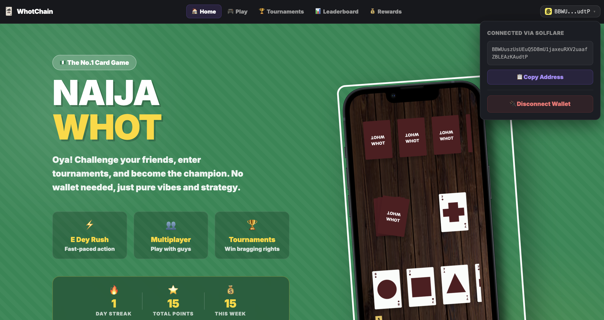

# WhotChain Backend — Game Server & Torque Integration 🎮

<br />



<br />

Backend server for WhotChain, a Solana-powered Naija Whot card game. Handles real-time multiplayer sessions, player stats, points/streak tracking, and fires custom events to **[Torque Protocol](https://torque.so)** for growth incentives.

🎮 **Live App**: [https://whot.xendex.com.ng](https://whot.xendex.com.ng)
⚙️ **Live API**: [https://api.whot.xendex.com.ng](https://api.whot.xendex.com.ng)
💻 **Frontend Repo**: [https://github.com/vortex-hue/dex-naija-whot](https://github.com/vortex-hue/dex-naija-whot)

## ⚙️ Tech Stack

- **Node.js** & **Express** — HTTP API
- **Socket.io** — Real-time multiplayer game engine
- **MongoDB** (primary) / **SQLite** (fallback) — Player data
- **Torque Events API** — Custom event ingestion for growth leaderboards

## 🚀 Running Locally

### Prerequisites
- Node.js v18+
- MongoDB URI (or falls back to SQLite automatically)
- Torque API keys (for event ingestion)

### Setup

1. **Clone and install**
   ```bash
   git clone https://github.com/vortex-hue/dex-naija-whot-backend.git
   cd dex-naija-whot-backend
   npm install
   ```

2. **Configure environment**
   ```bash
   cp .env.example .env
   # Fill in your MongoDB URI and Torque keys
   ```

3. **Start the server**
   ```bash
   npm start
   # Server starts on port 8080
   ```

### Environment Variables

| Variable | Description | Required |
|---|---|---|
| `PORT` | Server port | No (default: 8080) |
| `MONGODB_URI` | MongoDB connection string | No (falls back to SQLite) |
| `TORQUE_INGEST_API_KEY` | Torque event ingestion API key | Yes |
| `TORQUE_API_KEY` | Torque MCP auth token | Yes |
| `TORQUE_WHOTCHAIN_PROJECT_ID` | Torque project ID | Yes |
| `TORQUE_EVENT_GAME_WON` | Custom event ID for game wins | Yes |
| `TORQUE_EVENT_GAME_PLAYED` | Custom event ID for games played | Yes |
| `TORQUE_EVENT_DAILY_LOGIN` | Custom event ID for daily logins | Yes |
| `TORQUE_EVENT_PVP_WON` | Custom event ID for PvP wins | Yes |
| `TORQUE_EVENT_STREAK_7` | Custom event ID for 7-day streaks | Yes |
| `TORQUE_EVENT_STREAK_30` | Custom event ID for 30-day streaks | Yes |
| `CORS_ORIGINS` | Comma-separated allowed origins | No |

## 📡 API Endpoints

### Health
| Method | Path | Description |
|---|---|---|
| `GET` | `/` | Server status |
| `GET` | `/api/health` | Detailed health (rooms count) |

### Player Management
| Method | Path | Description |
|---|---|---|
| `GET` | `/api/leaderboard` | Top players by XP (30s cache) |
| `GET` | `/api/user/:address` | Get user profile |
| `GET` | `/api/user/:address/points` | Get points, weekly points, streak |
| `POST` | `/api/report-match` | Report game result + fire Torque event |
| `POST` | `/api/link-solana` | Link Solana address to profile |

### Report Match Payload
```json
{
  "address": "9KUm7YAdJEzFvghXN9dMYrBUFDc9cGPSGKH2nyvn2VvN",
  "result": "WIN",
  "mode": "solo"
}
```

**Response:**
```json
{
  "success": true,
  "pointsAwarded": 35
}
```

Points breakdown: 10 (daily login) + 25 (win) = 35

## 🔗 Torque Integration

### Event Flow
```
Player wins → GameOver.jsx calls POST /api/report-match
  → Backend awards points (25 win / 5 loss / 10 daily)
  → Backend fires Torque event via POST https://ingest.torque.so/events
  → Torque ingests event (202 ACCEPTED)
  → Weekly leaderboard evaluates → SOL distributed to top players
```

### Custom Events

| Event Name | Torque ID | Fired When |
|---|---|---|
| `whot_game_won` | `cmo9mc7j600swl91ixv8psgyh` | Player wins a game |
| `whot_game_played` | `cmo9mck0p00syl91i3qscyo88` | Player loses a game |
| `whot_daily_login` | `cmo9mckl300t0l91i7nqtxmm9` | First game of the day |
| `whot_pvp_won` | `cmo9mcksu00t2l91i4dxvpbt6` | Player wins PvP match |
| `whot_streak_7` | `cmo9mcl0d00t4l91iegk8xj0x` | 7 consecutive daily logins |
| `whot_streak_30` | `cmo9mcl8k00t6l91ic5mae816` | 30 consecutive daily logins |

### Event Payload Format
```json
{
  "userPubkey": "<solana-wallet-address>",
  "timestamp": 1745305000000,
  "eventName": "whot_game_won",
  "data": {
    "points": 25,
    "mode": "solo"
  }
}
```

### Incentive
- **Weekly WhotChain Leaderboard** (ID: `cmo9q5rzq00tql91imczk47wd`)
- Type: Leaderboard | Interval: WEEKLY | Emission: SOL
- SQL: `SELECT userPubkey AS address, COUNT(*) AS value FROM customevent_partitioned WHERE eventId = '...' GROUP BY userPubkey ORDER BY value DESC`

## 🎮 Socket.io Events

### Client → Server
| Event | Description |
|---|---|
| `join_room` | Join a game room |
| `sendUpdatedState` | Send game state update |
| `game_over` | End game session |
| `confirmOnlineState` | Confirm player is online |

### Server → Client
| Event | Description |
|---|---|
| `dispatch` | Game state updates |
| `error` | Error messages |
| `confirmOnlineState` | Online status request |
| `opponentOnlineStateChanged` | Opponent went online/offline |

## 📁 Project Structure

```
dex-naija-whot-backend/
├── index.js                     # Main server (Express + Socket.io + API routes)
├── src/
│   ├── database/
│   │   └── db.js                # MongoDB/SQLite adapter (users, points, streaks)
│   └── torque/
│       └── events.js            # Torque event emitter (fire-and-forget)
├── utils/
│   ├── classes/
│   │   └── Card.js              # Card class
│   └── functions/
│       ├── initializeDeck.js    # Deck initialization
│       ├── randomCard.js        # Random card selection
│       └── reverseState.js      # Game state reversal
├── setup-incentive.js           # One-time script to create Torque incentive
├── .env                         # Environment configuration
└── package.json
```

## 🔧 Address Validation

The server accepts both **Solana** (base58, 32-44 chars) and **EVM** (0x, 42 chars) wallet addresses:

```js
const isValidAddress = (addr) => {
    if (typeof addr !== 'string' || addr.length < 20) return false;
    if (addr.startsWith('0x') && addr.length === 42) return true;
    if (/^[1-9A-HJ-NP-Za-km-z]{32,44}$/.test(addr)) return true;
    return false;
};
```

## 🤝 Contributing

Contributions are welcome! Fork the repo, create a feature branch, and submit a PR.

## 📄 License

MIT License